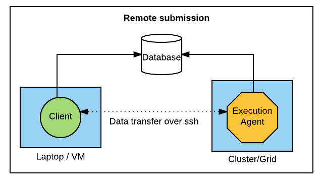

# Local and Remote submission modes using RADICAL Pilot, Ensemble Toolkit

This document describes two submission modes in RADICAL Pilot and Ensemble Toolkit, namely, Local and Remote submission modes. 

There are 3 major components of any script:

* Client - This is the script that the user creates and executes.
* Execution Agent - This is set of processes that run on the targetted machine. These processes enable the execution of the actual science tools within tasks.
* Database - A database is used to coordinate activities between the client and the execution agent.

There are few general requirements in this setup:

* The client runs on a persistent machine.
* The database runs on a persistent machine and is accessible by the machine(s) where the client and the execution agent exist.

## Local submission 

In this mode, both the client and the agent run on the same machine. The machine could be a laptop, VM. There is an important distinction when the resource is a cluster/grid.

In the case of a cluster/grid, the client script usually sits on the head/login nodes of the cluster/grid. Depending on the specifications given by the user, the execution agent can execute on the head/login nodes (generally not recommended - but for example, small tests) or the compute nodes of the cluster (for actual experiments). In either case, the client script runs on the head/login node. If the client script is intensive or the load on the login nodes are high (due to multiple users say), the node may be unavailable or slow resulting in possibly the execution slowdown or possibly termination by admins.

Note: In a cluster/grid, when the execution agent is also on the head/login node, then the scenario becomes equivalent to a laptop or VM.

## Remote submission

Due to the above constraints on some of the clusters/grids, a remote submission mechanism could be very useful. In this mode, the client script sits on a persistent machine and the execution agent on the compute nodes of the cluster/grid. The head/login node is still used but primarily for logging in to the machine and submitting a resource reservation.

This requires a passwordless ssh login to the particular cluster/grid. [This](http://linuxproblem.org/art_9.html) document gives the basic steps in setting up passwordless login to any machine.

## Some more details

* The location of the database does not effect the execution too significantly (apart from latency). The requirements are that the database be on a persistent machine + accessible by both client and agent. But, the client may not be executed on head nodes of clusters for the same reason as stated above.

* www.mlab.com is a recommendation and is also used by the RADICAL team.